Proyecto 3 final
================

## Librerias

``` r
library(psych)
library(dplyr)
```

    ## 
    ## Attaching package: 'dplyr'

    ## The following objects are masked from 'package:stats':
    ## 
    ##     filter, lag

    ## The following objects are masked from 'package:base':
    ## 
    ##     intersect, setdiff, setequal, union

``` r
library(stringr)
library(datasets.load)
library(tidyverse)
```

    ## -- Attaching packages --------------------------------------- tidyverse 1.3.1 --

    ## v ggplot2 3.3.3     v readr   1.4.0
    ## v tibble  3.1.1     v purrr   0.3.4
    ## v tidyr   1.1.3     v forcats 0.5.1

    ## -- Conflicts ------------------------------------------ tidyverse_conflicts() --
    ## x ggplot2::%+%()   masks psych::%+%()
    ## x ggplot2::alpha() masks psych::alpha()
    ## x dplyr::filter()  masks stats::filter()
    ## x dplyr::lag()     masks stats::lag()

``` r
library(tm)
```

    ## Loading required package: NLP

    ## 
    ## Attaching package: 'NLP'

    ## The following object is masked from 'package:ggplot2':
    ## 
    ##     annotate

``` r
library(tidytext)
library(quanteda)
```

    ## Package version: 3.0.0
    ## Unicode version: 10.0
    ## ICU version: 61.1

    ## Parallel computing: 8 of 8 threads used.

    ## See https://quanteda.io for tutorials and examples.

    ## 
    ## Attaching package: 'quanteda'

    ## The following object is masked from 'package:tm':
    ## 
    ##     stopwords

    ## The following objects are masked from 'package:NLP':
    ## 
    ##     meta, meta<-

``` r
library(quanteda.textstats)
library(ggplot2)
library(wordcloud)
```

    ## Loading required package: RColorBrewer

``` r
library(lubridate)
```

    ## 
    ## Attaching package: 'lubridate'

    ## The following objects are masked from 'package:base':
    ## 
    ##     date, intersect, setdiff, union

``` r
library(readxl)
library(chron)
```

    ## 
    ## Attaching package: 'chron'

    ## The following objects are masked from 'package:lubridate':
    ## 
    ##     days, hours, minutes, seconds, years

``` r
library(factoextra)
```

    ## Welcome! Want to learn more? See two factoextra-related books at https://goo.gl/ve3WBa

``` r
library(flexclust)
```

    ## Loading required package: grid

    ## Loading required package: lattice

    ## Loading required package: modeltools

    ## Loading required package: stats4

``` r
library(cluster)
#library(ggdendro)
library(factoextra)
library(knitr)
library(mclust)
```

    ## Package 'mclust' version 5.4.7
    ## Type 'citation("mclust")' for citing this R package in publications.

    ## 
    ## Attaching package: 'mclust'

    ## The following object is masked from 'package:purrr':
    ## 
    ##     map

    ## The following object is masked from 'package:psych':
    ## 
    ##     sim

``` r
library(dbscan)
library(e1071)
```

    ## 
    ## Attaching package: 'e1071'

    ## The following object is masked from 'package:flexclust':
    ## 
    ##     bclust

``` r
library(olsrr)
```

    ## 
    ## Attaching package: 'olsrr'

    ## The following object is masked from 'package:datasets':
    ## 
    ##     rivers

``` r
library(pROC)
```

    ## Type 'citation("pROC")' for a citation.

    ## 
    ## Attaching package: 'pROC'

    ## The following objects are masked from 'package:stats':
    ## 
    ##     cov, smooth, var

``` r
library(class)
library(discrim)
```

    ## Loading required package: parsnip

    ## 
    ## Attaching package: 'parsnip'

    ## The following object is masked from 'package:modeltools':
    ## 
    ##     fit

``` r
library(tidymodels)
```

    ## Registered S3 method overwritten by 'tune':
    ##   method                   from   
    ##   required_pkgs.model_spec parsnip

    ## -- Attaching packages -------------------------------------- tidymodels 0.1.3 --

    ## v broom        0.7.6      v rsample      0.1.0 
    ## v dials        0.0.9      v tune         0.1.5 
    ## v infer        0.5.4      v workflows    0.2.2 
    ## v modeldata    0.1.0      v workflowsets 0.0.2 
    ## v recipes      0.1.16     v yardstick    0.0.8

    ## -- Conflicts ----------------------------------------- tidymodels_conflicts() --
    ## x ggplot2::%+%()          masks psych::%+%()
    ## x scales::alpha()         masks ggplot2::alpha(), psych::alpha()
    ## x NLP::annotate()         masks ggplot2::annotate()
    ## x scales::discard()       masks purrr::discard()
    ## x dplyr::filter()         masks stats::filter()
    ## x parsnip::fit()          masks modeltools::fit()
    ## x recipes::fixed()        masks stringr::fixed()
    ## x dplyr::lag()            masks stats::lag()
    ## x mclust::map()           masks purrr::map()
    ## x tune::parameters()      masks dials::parameters(), flexclust::parameters(), modeltools::parameters()
    ## x rsample::permutations() masks e1071::permutations()
    ## x yardstick::spec()       masks readr::spec()
    ## x recipes::step()         masks stats::step()
    ## x tune::tune()            masks e1071::tune()
    ## x recipes::update()       masks stats4::update(), stats::update()
    ## * Use tidymodels_prefer() to resolve common conflicts.

``` r
library(naivebayes)
```

    ## naivebayes 0.9.7 loaded

``` r
library(kknn)
library(patchwork)
library(caret)
```

    ## 
    ## Attaching package: 'caret'

    ## The following object is masked from 'package:kknn':
    ## 
    ##     contr.dummy

    ## The following objects are masked from 'package:yardstick':
    ## 
    ##     precision, recall, sensitivity, specificity

    ## The following object is masked from 'package:purrr':
    ## 
    ##     lift

``` r
library(yardstick)
```

\#\#Cargando datos

``` r
#endurance <- `endurance (1)`
```

\#\#leemos un archivo

``` r
setwd("C:/Users/Dieca/OneDrive/Escritorio/p3 final")
endurance <- read.csv("endurance.csv", sep = ",")
endurance <- endurance %>% select(- c(X))
summary(endurance)
```

    ##        id                type           athlete            calories       
    ##  Min.   :     1   EBikeRide:   587   Min.   : 8558143   Min.   :     0.0  
    ##  1st Qu.: 41905   Hike     :  2071   1st Qu.:14204866   1st Qu.:   281.0  
    ##  Median : 83808   Ride     :109536   Median :15621719   Median :   629.0  
    ##  Mean   : 83808   Run      : 51970   Mean   :15359426   Mean   :   816.7  
    ##  3rd Qu.:125712   Walk     :  3451   3rd Qu.:16685446   3rd Qu.:  1076.8  
    ##  Max.   :167615                      Max.   :18078075   Max.   :326157.3  
    ##                                                                           
    ##     distance          elev_low          records          elev_high      
    ##  Min.   :      0   Min.   :-3257.1   Min.   :  0.000   Min.   : -500.0  
    ##  1st Qu.:   6159   1st Qu.:  222.8   1st Qu.:  0.000   1st Qu.:  476.8  
    ##  Median :  12968   Median :  595.8   Median :  0.000   Median :  728.8  
    ##  Mean   :  21998   Mean   :  557.4   Mean   :  1.791   Mean   :  848.2  
    ##  3rd Qu.:  27494   3rd Qu.:  774.0   3rd Qu.:  1.000   3rd Qu.: 1141.4  
    ##  Max.   :1479320   Max.   :11302.4   Max.   :622.000   Max.   :12606.8  
    ##                    NA's   :13519                       NA's   :13519    
    ##    max_speed                      device_name      moving_time      
    ##  Min.   :  0.000   Strava iPhone App    : 14599   Min.   :       0  
    ##  1st Qu.:  4.800   Garmin Edge 520      : 13782   1st Qu.:    2248  
    ##  Median :  9.800   Garmin fēnix 3      :  9742   Median :    3853  
    ##  Mean   :  9.693   Strava Android App   :  9509   Mean   :    5141  
    ##  3rd Qu.: 13.700   Garmin Forerunner 935:  6494   3rd Qu.:    6516  
    ##  Max.   :244.600   (Other)              :109987   Max.   :11025474  
    ##                    NA's                 :  3502                     
    ##   elapsed_time       average_speed      has_heartrate  
    ##  Min.   :        0   Min.   :   0.000   Mode :logical  
    ##  1st Qu.:     2582   1st Qu.:   2.606   FALSE:65290    
    ##  Median :     4450   Median :   3.536   TRUE :102325   
    ##  Mean   :    32102   Mean   :   4.146                  
    ##  3rd Qu.:     7934   3rd Qu.:   5.747                  
    ##  Max.   :511111044   Max.   :2296.088                  
    ##                                                        
    ##             start_date_local  total_elevation_gain
    ##  2018-12-02 06:26:02:     5   Min.   :    0.0     
    ##  2013-02-06 16:08:27:     3   1st Qu.:   15.1     
    ##  2015-11-09 16:47:06:     3   Median :  171.0     
    ##  2016-05-01 06:36:06:     3   Mean   :  397.0     
    ##  2018-11-13 06:09:39:     3   3rd Qu.:  595.0     
    ##  2018-11-17 07:03:16:     3   Max.   :59595.0     
    ##  (Other)            :167595

``` r
glimpse(endurance)
```

    ## Rows: 167,615
    ## Columns: 16
    ## $ id                   <int> 1, 2, 3, 4, 5, 6, 7, 8, 9, 10, 11, 12, 13, 14, 15~
    ## $ type                 <fct> Ride, Ride, Ride, Ride, Ride, Ride, Ride, Ride, R~
    ## $ athlete              <dbl> 13279977, 13279977, 13279977, 13279977, 13279977,~
    ## $ calories             <dbl> 520.9, 538.0, 741.6, 314.5, 696.5, 109.1, 510.9, ~
    ## $ distance             <dbl> 13130.5, 12938.7, 17515.7, 7931.4, 17072.7, 3195.~
    ## $ elev_low             <dbl> 337.3, 338.5, 301.6, 339.2, 336.2, 333.6, 336.1, ~
    ## $ records              <int> 0, 1, 0, 0, 1, 0, 0, 1, 1, 0, 0, 0, 0, 0, 0, 0, 0~
    ## $ elev_high            <dbl> 375.6, 477.0, 377.0, 389.7, 389.4, 369.1, 379.9, ~
    ## $ max_speed            <dbl> 10.5, 11.4, 11.6, 10.2, 14.2, 6.8, 11.5, 9.9, 15.~
    ## $ device_name          <fct> Strava iPhone App, Strava iPhone App, Strava iPho~
    ## $ moving_time          <int> 3908, 3791, 3837, 2280, 4188, 1237, 2873, 2439, 5~
    ## $ elapsed_time         <int> 4326, 4975, 4510, 2521, 4473, 4166, 3390, 2759, 5~
    ## $ average_speed        <dbl> 3.360, 3.413, 4.565, 3.479, 4.077, 2.583, 4.363, ~
    ## $ has_heartrate        <lgl> FALSE, FALSE, FALSE, FALSE, FALSE, FALSE, FALSE, ~
    ## $ start_date_local     <fct> 2015-10-25 07:33:45, 2015-10-23 06:44:01, 2015-10~
    ## $ total_elevation_gain <dbl> 206.0, 287.9, 309.1, 156.4, 268.8, 36.3, 192.6, 1~

\#\#Pasamos los atributos a forma numerica

``` r
endurance$elev_low <- as.numeric(endurance$elev_low)
endurance$elev_high <- as.numeric(endurance$elev_high )
endurance$max_speed <- as.numeric(endurance$max_speed)
endurance$average_speed <- as.numeric(endurance$average_speed )

#endurance$calories <- as.double(endurance$calories)
#endurance$distance <- as.double(endurance$distance)
#endurance$elev_low <- as.double(endurance$elev_low)
#endurance$elev_high <- as.double(endurance$elev_high )
#endurance$max_speed <- as.double(endurance$max_speed)
#endurance$average_speed <- as.double(endurance$average_speed )
#endurance$total_elevation_gain <- as.double(endurance$total_elevation_gain)
#endurance$moving_time <- as.double(endurance$moving_time)
#endurance$elapsed_time <- as.double(endurance$elapsed_time)
```

\#\#Comprobamos datos NA y cambiamos tipo de data.

``` r
endurance %>% 
  summarise_all(funs(sum(is.na(.))))
```

    ## Warning: `funs()` was deprecated in dplyr 0.8.0.
    ## Please use a list of either functions or lambdas: 
    ## 
    ##   # Simple named list: 
    ##   list(mean = mean, median = median)
    ## 
    ##   # Auto named with `tibble::lst()`: 
    ##   tibble::lst(mean, median)
    ## 
    ##   # Using lambdas
    ##   list(~ mean(., trim = .2), ~ median(., na.rm = TRUE))

    ##   id type athlete calories distance elev_low records elev_high max_speed
    ## 1  0    0       0        0        0    13519       0     13519         0
    ##   device_name moving_time elapsed_time average_speed has_heartrate
    ## 1        3502           0            0             0             0
    ##   start_date_local total_elevation_gain
    ## 1                0                    0

``` r
str(endurance)
```

    ## 'data.frame':    167615 obs. of  16 variables:
    ##  $ id                  : int  1 2 3 4 5 6 7 8 9 10 ...
    ##  $ type                : Factor w/ 5 levels "EBikeRide","Hike",..: 3 3 3 3 3 3 3 3 3 3 ...
    ##  $ athlete             : num  13279977 13279977 13279977 13279977 13279977 ...
    ##  $ calories            : num  521 538 742 314 696 ...
    ##  $ distance            : num  13130 12939 17516 7931 17073 ...
    ##  $ elev_low            : num  337 338 302 339 336 ...
    ##  $ records             : int  0 1 0 0 1 0 0 1 1 0 ...
    ##  $ elev_high           : num  376 477 377 390 389 ...
    ##  $ max_speed           : num  10.5 11.4 11.6 10.2 14.2 6.8 11.5 9.9 15.9 10.1 ...
    ##  $ device_name         : Factor w/ 170 levels "Android Wear",..: 138 138 138 138 138 138 138 138 138 138 ...
    ##  $ moving_time         : int  3908 3791 3837 2280 4188 1237 2873 2439 5008 3148 ...
    ##  $ elapsed_time        : int  4326 4975 4510 2521 4473 4166 3390 2759 5706 4818 ...
    ##  $ average_speed       : num  3.36 3.41 4.57 3.48 4.08 ...
    ##  $ has_heartrate       : logi  FALSE FALSE FALSE FALSE FALSE FALSE ...
    ##  $ start_date_local    : Factor w/ 166695 levels "1999-04-25 17:36:38",..: 27344 27265 27168 27081 25656 25622 25239 24830 21745 21711 ...
    ##  $ total_elevation_gain: num  206 288 309 156 269 ...

``` r
# Para las observaciones que tengan datos faltantes, le asignamos el valor NA para eliminarlos en el siguiente paso
#endurance[endurance == ""] <- NA

endurance_pre<- endurance %>% 
  filter(!(is.na(elev_low)|is.na(elev_high)|is.na(device_name)))
endurance_pre %>% 
  summarise_all(funs(sum(is.na(.))))
```

    ##   id type athlete calories distance elev_low records elev_high max_speed
    ## 1  0    0       0        0        0        0       0         0         0
    ##   device_name moving_time elapsed_time average_speed has_heartrate
    ## 1           0           0            0             0             0
    ##   start_date_local total_elevation_gain
    ## 1                0                    0

``` r
summary(endurance_pre)
```

    ##        id                type          athlete            calories       
    ##  Min.   :     1   EBikeRide:  537   Min.   : 8558143   Min.   :     0.0  
    ##  1st Qu.: 41459   Hike     : 2061   1st Qu.:14127430   1st Qu.:   300.0  
    ##  Median : 82364   Ride     :99211   Median :15550715   Median :   668.0  
    ##  Mean   : 83211   Run      :47453   Mean   :15305007   Mean   :   854.6  
    ##  3rd Qu.:125040   Walk     : 2728   3rd Qu.:16653350   3rd Qu.:  1130.4  
    ##  Max.   :167615                     Max.   :18078075   Max.   :326157.3  
    ##                                                                          
    ##     distance          elev_low          records          elev_high      
    ##  Min.   :      0   Min.   :-3257.1   Min.   :  0.000   Min.   : -500.0  
    ##  1st Qu.:   6986   1st Qu.:  226.2   1st Qu.:  0.000   1st Qu.:  480.8  
    ##  Median :  13609   Median :  597.2   Median :  0.000   Median :  730.9  
    ##  Mean   :  23128   Mean   :  558.9   Mean   :  1.959   Mean   :  851.5  
    ##  3rd Qu.:  28980   3rd Qu.:  777.2   3rd Qu.:  1.000   3rd Qu.: 1144.4  
    ##  Max.   :1479320   Max.   :11302.4   Max.   :622.000   Max.   :12606.8  
    ##                                                                         
    ##    max_speed                     device_name     moving_time      
    ##  Min.   :  0.00   Strava iPhone App    :14586   Min.   :       0  
    ##  1st Qu.:  5.10   Garmin Edge 520      :13782   1st Qu.:    2308  
    ##  Median : 10.40   Garmin fēnix 3      : 9741   Median :    4050  
    ##  Mean   : 10.14   Strava Android App   : 9509   Mean   :    5322  
    ##  3rd Qu.: 14.00   Garmin Edge 510      : 6168   3rd Qu.:    6838  
    ##  Max.   :244.60   Garmin Forerunner 235: 5455   Max.   :11025474  
    ##                   (Other)              :92749                     
    ##   elapsed_time       average_speed      has_heartrate  
    ##  Min.   :        0   Min.   :   0.000   Mode :logical  
    ##  1st Qu.:     2702   1st Qu.:   2.686   FALSE:61701    
    ##  Median :     4788   Median :   3.601   TRUE :90289    
    ##  Mean   :    34998   Mean   :   4.236                  
    ##  3rd Qu.:     8368   3rd Qu.:   5.750                  
    ##  Max.   :511111044   Max.   :2296.088                  
    ##                                                        
    ##             start_date_local  total_elevation_gain
    ##  2018-12-02 06:26:02:     5   Min.   :    0.0     
    ##  2015-11-09 16:47:06:     3   1st Qu.:   35.0     
    ##  2016-05-01 06:36:06:     3   Median :  242.0     
    ##  2018-11-13 06:09:39:     3   Mean   :  434.3     
    ##  2018-11-17 07:03:16:     3   3rd Qu.:  638.0     
    ##  2018-11-18 03:42:38:     3   Max.   :59595.0     
    ##  (Other)            :151970

A partir de una analisis exploratoria de datos limpiaremos la data con
tal de no ensuciar nuestro modelo de clasificacion a futuro. Para esto
eliminaremos aquellos datos donde el max\_speed, moving\_time, distance
y calories tengan valor 0, ya que a fin de cuentas no son valores
representativos para un modelo de Clasificacion.

``` r
endurance_pre <- endurance_pre[endurance_pre$calories != 0,]
endurance_pre <- endurance_pre[endurance_pre$moving_time != 0,]
endurance_pre <- endurance_pre[endurance_pre$distance != 0,]
endurance_pre <- endurance_pre[endurance_pre$max_speed != 0,]

summary(endurance_pre)
```

    ##        id                type          athlete            calories       
    ##  Min.   :     1   EBikeRide:  501   Min.   : 8558143   Min.   :     0.1  
    ##  1st Qu.: 42812   Hike     : 1975   1st Qu.:14079231   1st Qu.:   379.0  
    ##  Median : 82913   Ride     :89606   Median :15433955   Median :   721.3  
    ##  Mean   : 83956   Run      :45628   Mean   :15260662   Mean   :   920.1  
    ##  3rd Qu.:126178   Walk     : 2413   3rd Qu.:16623691   3rd Qu.:  1186.2  
    ##  Max.   :167615                     Max.   :18078075   Max.   :326157.3  
    ##                                                                          
    ##     distance            elev_low          records          elev_high      
    ##  Min.   :      0.3   Min.   :-3257.1   Min.   :  0.000   Min.   : -500.0  
    ##  1st Qu.:   7512.6   1st Qu.:  211.0   1st Qu.:  0.000   1st Qu.:  471.4  
    ##  Median :  14119.1   Median :  596.4   Median :  0.000   Median :  739.2  
    ##  Mean   :  23965.1   Mean   :  556.4   Mean   :  2.017   Mean   :  860.3  
    ##  3rd Qu.:  29968.3   3rd Qu.:  781.8   3rd Qu.:  1.000   3rd Qu.: 1166.6  
    ##  Max.   :1479320.0   Max.   :10490.2   Max.   :622.000   Max.   :12606.8  
    ##                                                                           
    ##    max_speed                     device_name     moving_time     
    ##  Min.   :  0.10   Strava iPhone App    :13216   Min.   :      1  
    ##  1st Qu.:  5.30   Garmin Edge 520      :12153   1st Qu.:   2379  
    ##  Median : 10.60   Garmin fēnix 3      : 9077   Median :   4170  
    ##  Mean   : 10.41   Strava Android App   : 8542   Mean   :   5356  
    ##  3rd Qu.: 14.20   Garmin Edge 510      : 5396   3rd Qu.:   6984  
    ##  Max.   :167.80   Garmin Forerunner 235: 5307   Max.   :3156689  
    ##                   (Other)              :86432                    
    ##   elapsed_time       average_speed      has_heartrate  
    ##  Min.   :        0   Min.   :   0.000   Mode :logical  
    ##  1st Qu.:     2775   1st Qu.:   2.737   FALSE:55490    
    ##  Median :     4954   Median :   3.644   TRUE :84633    
    ##  Mean   :    34186   Mean   :   4.308                  
    ##  3rd Qu.:     8556   3rd Qu.:   5.801                  
    ##  Max.   :511111044   Max.   :2296.088                  
    ##                                                        
    ##             start_date_local  total_elevation_gain
    ##  2018-12-02 06:26:02:     5   Min.   :    0.0     
    ##  2015-11-09 16:47:06:     3   1st Qu.:   44.0     
    ##  2016-05-01 06:36:06:     3   Median :  272.0     
    ##  2018-11-13 06:09:39:     3   Mean   :  454.2     
    ##  2018-11-17 07:03:16:     3   3rd Qu.:  658.0     
    ##  2018-11-18 03:42:38:     3   Max.   :59595.0     
    ##  (Other)            :140103

\#\#MOdelo de regresion lineal previo para ver datos atipicos en
distancia

``` r
endurance_pre$type <- as.factor(endurance_pre$type)
ggplot(endurance_pre, aes(type,distance)) + 
  geom_point()
```

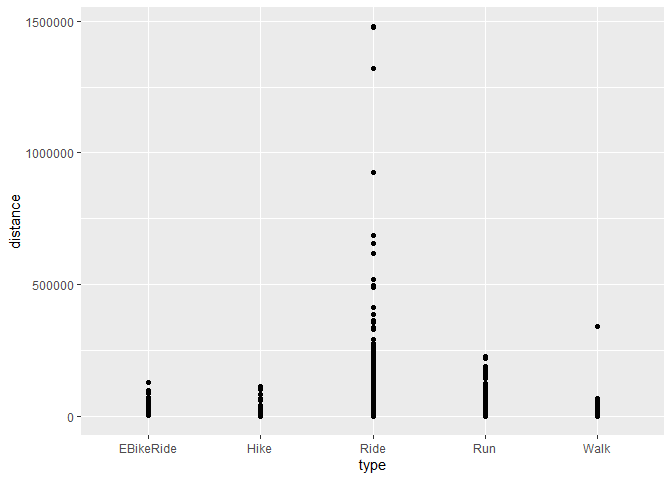<!-- --> Con
este modelo de regresion lineal podemos ver aquellos datos atipicos que
se alejan demaciado de la media. por ejemplo en Ride eliminaremos todas
aquellas distincias que superan los 500000 para no ensuciar nuestra
prediccion a futuro. 1479320 1478170 1319550 1043360 924814 686231
686231 657326 654208 615937 520048 Son todos aquellos datos que
excluimos de la data

``` r
endurance_pre <- endurance_pre %>% filter(distance < 500000)

ggplot(endurance_pre, aes(type,distance)) + 
  geom_point() +
  geom_smooth(method = "lm")
```

    ## `geom_smooth()` using formula 'y ~ x'

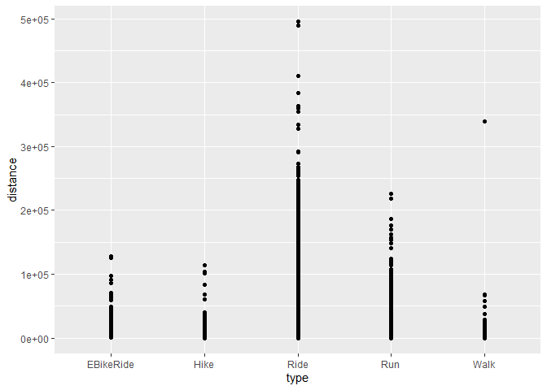<!-- -->

\#\#MOdelo de regresion lineal previo de maxima velocidad

``` r
ggplot(endurance_pre, aes(type,max_speed)) + 
  geom_point()
```

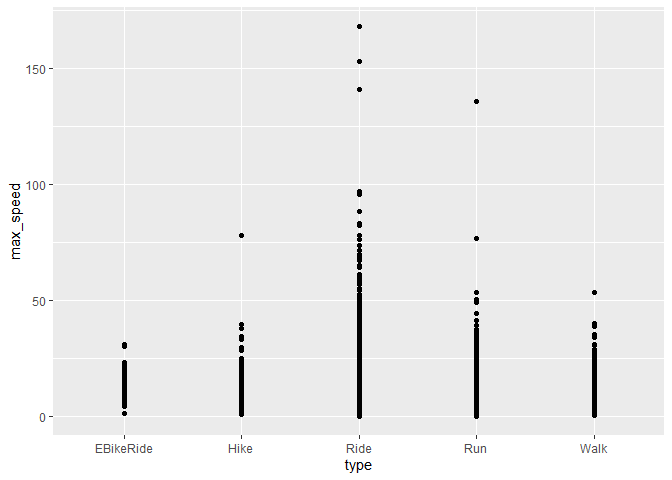<!-- --> Es
raro ver datos de velocidad mayores a 100km/hr en bicicletas, incluso en
bici electrica. Tmabien vemos Velocidades en Run superiores a los 50 y
en caminatas.

Un ciclista promedio alcanza los 29 km/Hr Y un profesional unos 42 km/Hr
para que se alcancen velocidades superiores a esta se debe estar
realizando descenso.

Considerando que el maximo de esta data es de 244 km/hr y hay pocos
casos superiores a los 80 km/hr excluiremos los datos atipicos mayores a
80 km/hr 244.600 167.800 152.900 140.600 135.600 117.900 96.700 95.700
91.800 88.100 83.000 82.400 82.000 81.900 Son todos aquellos datos que
excluimos de la data

``` r
endurance_pre <- endurance_pre %>% filter(max_speed < 80)

ggplot(endurance_pre, aes(type,max_speed)) + 
  geom_point() +
  geom_smooth(method = "lm")
```

    ## `geom_smooth()` using formula 'y ~ x'

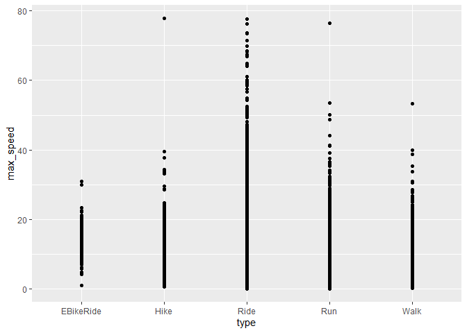<!-- -->

ahora con moving time

``` r
ggplot(endurance_pre, aes(type,moving_time)) + 
  geom_point()
```

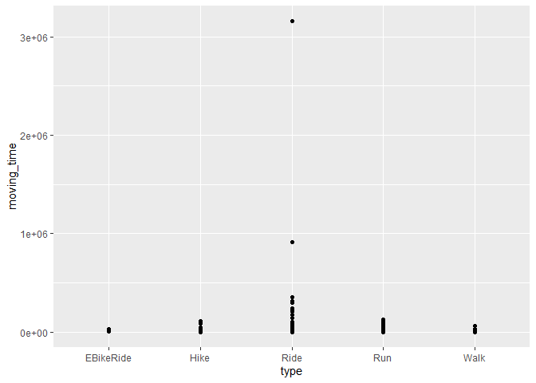<!-- -->
11025474 3156689 909135 608912 514043 350178 Son todos aquellos datos
que excluimos de la data

excluir datos de moving time, aquellos que son mayores que 348964, ya
que la data empieza a ser representativa a partir de este numero.

``` r
endurance_pre <- endurance_pre %>% filter(moving_time < 348964)

ggplot(endurance_pre, aes(type,moving_time)) + 
  geom_point() +
  geom_smooth(method = "lm")
```

    ## `geom_smooth()` using formula 'y ~ x'

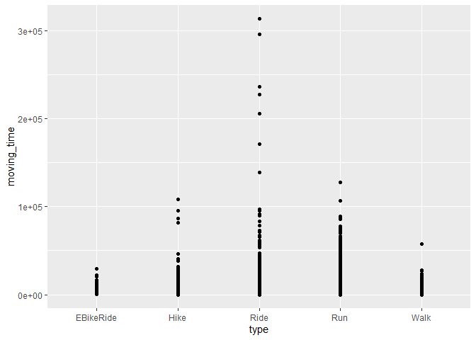<!-- -->

\#\#MOdelo de regresion lineal previo para ver datos atipicos en
elev\_high

``` r
ggplot(endurance_pre, aes(type,elev_high)) + 
  geom_point()
```

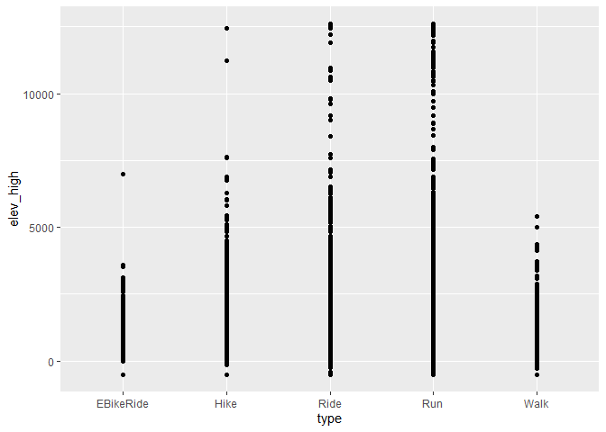<!-- -->
Por lo visto son valores normales.

\#\#MOdelo de regresion lineal previo para ver datos atipicos en
elev\_low

``` r
ggplot(endurance_pre, aes(type,elev_low)) + 
  geom_point()
```

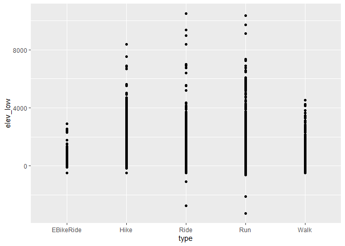<!-- -->
Por lo visto son valores normales.

elapsed\_time

``` r
ggplot(endurance_pre, aes(type,elapsed_time)) + 
  geom_point()
```

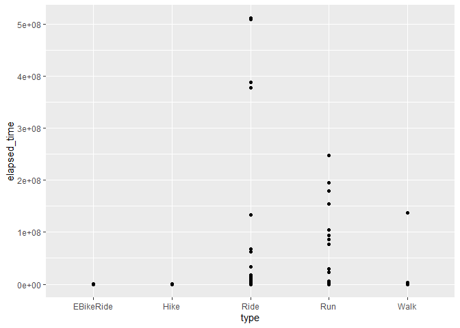<!-- -->
Llaman la antencion estos valores, pero no los eliminaremos. 511111044
509024893 388497176 387979240 377464622 247658308 exluir datos de
elapsed\_time

average\_speed

``` r
ggplot(endurance_pre, aes(type,average_speed)) + 
  geom_point()
```

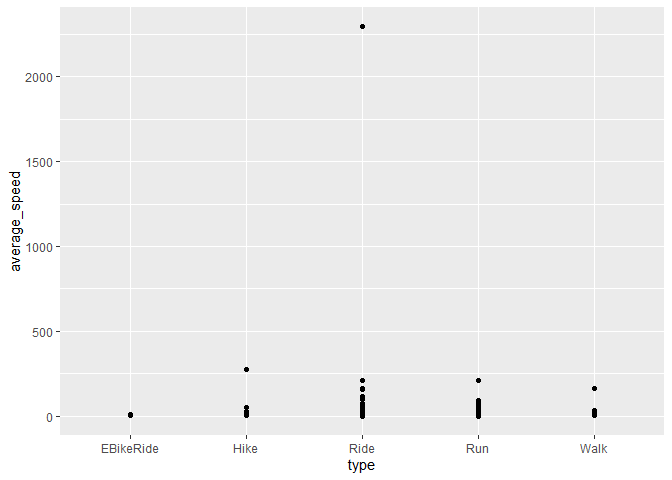<!-- -->

Llaman la atencion estos datos, lo eliminaremos porque puden ensuciar
nuestro modelo de prediccion. 2296.088 866.710 792.677 362.215 360.120
274.200 217.417 209.600 208.557 179.900 177.163 161.312 159.302 155.800

exluir datos de average\_speed que son mayor a 150

``` r
endurance_pre <- endurance_pre %>% filter(average_speed < 150)

ggplot(endurance_pre, aes(type,average_speed)) + 
  geom_point() +
  geom_smooth(method = "lm")
```

    ## `geom_smooth()` using formula 'y ~ x'

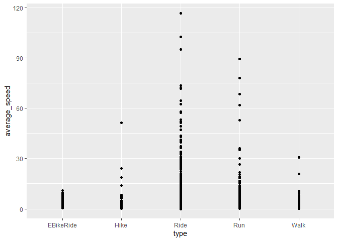<!-- -->

\#Sepamos los atributos especiales atributos\[“distance” , “elev\_low”,
“elev\_high”, “max\_speed”, “moving\_time”, “elapsed\_time”,
“average\_speed”,“total\_elevation\_gain”\]

``` r
atributos_num <- c("type","calories","distance" , "elev_low", "elev_high", "max_speed", "moving_time", "elapsed_time", "average_speed","total_elevation_gain")


endurance_num <- endurance_pre %>% 
  select(atributos_num)
```

    ## Note: Using an external vector in selections is ambiguous.
    ## i Use `all_of(atributos_num)` instead of `atributos_num` to silence this message.
    ## i See <https://tidyselect.r-lib.org/reference/faq-external-vector.html>.
    ## This message is displayed once per session.

``` r
unique(endurance_num$type)
```

    ## [1] Ride      Run       Walk      Hike      EBikeRide
    ## Levels: EBikeRide Hike Ride Run Walk

``` r
endurance_num$type <- as.factor(endurance_num$type)
```

Pasamos la variable type a factor para poder hacer los estudios
correspondientes

Utilizamos el modelo logístico Multivariable para ver la
representatividad estadística de cada variable.

``` r
endurance_num$prob <- NULL

modelo_logistico_multi <- glm(type ~ ., endurance_num, family = "binomial")
```

    ## Warning: glm.fit: fitted probabilities numerically 0 or 1 occurred

``` r
summary(modelo_logistico_multi)
```

    ## 
    ## Call:
    ## glm(formula = type ~ ., family = "binomial", data = endurance_num)
    ## 
    ## Deviance Residuals: 
    ##     Min       1Q   Median       3Q      Max  
    ## -3.6943   0.0627   0.0726   0.0896   2.9118  
    ## 
    ## Coefficients:
    ##                        Estimate Std. Error z value Pr(>|z|)    
    ## (Intercept)           6.263e+00  1.325e-01  47.257  < 2e-16 ***
    ## calories             -1.678e-04  3.950e-05  -4.248 2.16e-05 ***
    ## distance              1.242e-05  3.038e-06   4.088 4.36e-05 ***
    ## elev_low             -3.561e-04  9.402e-05  -3.787 0.000152 ***
    ## elev_high            -1.385e-04  7.366e-05  -1.880 0.060118 .  
    ## max_speed            -1.129e-01  6.116e-03 -18.458  < 2e-16 ***
    ## moving_time           6.231e-06  9.250e-06   0.674 0.500528    
    ## elapsed_time          4.454e-06  4.574e-06   0.974 0.330192    
    ## average_speed         2.124e-01  3.290e-02   6.455 1.08e-10 ***
    ## total_elevation_gain -4.082e-05  3.655e-05  -1.117 0.264051    
    ## ---
    ## Signif. codes:  0 '***' 0.001 '**' 0.01 '*' 0.05 '.' 0.1 ' ' 1
    ## 
    ## (Dispersion parameter for binomial family taken to be 1)
    ## 
    ##     Null deviance: 6644.9  on 140093  degrees of freedom
    ## Residual deviance: 6260.7  on 140084  degrees of freedom
    ## AIC: 6280.7
    ## 
    ## Number of Fisher Scoring iterations: 15

Podemos ver que Colories, eleve\_low , average\_speed, max\_speed,
distance y moving time son variables representativas del modelo.

``` r
endurance_num$prob_multi <- predict(modelo_logistico_multi, type=c("response"))

auc(roc(type ~ prob_multi, data = endurance_num))
```

    ## Warning in roc.default(response, predictors[, 1], ...): 'response' has more
    ## than two levels. Consider setting 'levels' explicitly or using 'multiclass.roc'
    ## instead

    ## Setting levels: control = EBikeRide, case = Hike

    ## Setting direction: controls < cases

    ## Area under the curve: 0.6972

Al incluir todas las variables vemos que algunas de ellas tienen
significancia estadística, pero otras no, por lo que deberían ser
descartadas en el modelo. Estos resultados pueden darse debido a sobre
entrenamiento del modelo, por lo que haremos la prueba con un conjunto
de entrenamiento y un conjunto de prueba.

``` r
set.seed(42)
sample <- sample(1:nrow(endurance_num), .8*10000)

endurance_num_train <- endurance_num[sample,]
endurance_num_test <- endurance_num[-sample,]
modelo_logistico_multi <- glm(type ~ calories + distance + elev_low + max_speed + total_elevation_gain + elev_high + moving_time, endurance_num_train, family = "binomial")
summary(modelo_logistico_multi)
```

    ## 
    ## Call:
    ## glm(formula = type ~ calories + distance + elev_low + max_speed + 
    ##     total_elevation_gain + elev_high + moving_time, family = "binomial", 
    ##     data = endurance_num_train)
    ## 
    ## Deviance Residuals: 
    ##     Min       1Q   Median       3Q      Max  
    ## -3.5492   0.0683   0.0817   0.1016   0.7986  
    ## 
    ## Coefficients:
    ##                        Estimate Std. Error z value Pr(>|z|)    
    ## (Intercept)           6.839e+00  3.923e-01  17.435  < 2e-16 ***
    ## calories              2.489e-04  3.690e-04   0.675   0.4999    
    ## distance              2.572e-05  1.160e-05   2.217   0.0266 *  
    ## elev_low             -7.741e-04  5.975e-04  -1.296   0.1951    
    ## max_speed            -1.148e-01  2.356e-02  -4.874 1.09e-06 ***
    ## total_elevation_gain -3.192e-04  3.808e-04  -0.838   0.4018    
    ## elev_high             1.488e-04  5.314e-04   0.280   0.7794    
    ## moving_time          -7.396e-05  4.980e-05  -1.485   0.1375    
    ## ---
    ## Signif. codes:  0 '***' 0.001 '**' 0.01 '*' 0.05 '.' 0.1 ' ' 1
    ## 
    ## (Dispersion parameter for binomial family taken to be 1)
    ## 
    ##     Null deviance: 460.9  on 7999  degrees of freedom
    ## Residual deviance: 434.3  on 7992  degrees of freedom
    ## AIC: 450.3
    ## 
    ## Number of Fisher Scoring iterations: 8

``` r
endurance_num_test$prob_multi <- predict(modelo_logistico_multi, endurance_num_test, type=c("response"))

auc(roc(type ~ prob_multi, data = endurance_num_test))
```

    ## Warning in roc.default(response, predictors[, 1], ...): 'response' has more
    ## than two levels. Consider setting 'levels' explicitly or using 'multiclass.roc'
    ## instead

    ## Setting levels: control = EBikeRide, case = Hike

    ## Setting direction: controls < cases

    ## Area under the curve: 0.7611

## Vemos que el AUC SUBIO un poco de 69.72%, a 76.11% pero sigue siendo un excelente resultado. Debido a que el porcentaje varia super poco y sigue siendo representativo evaluaremos las variables que no son tan representativas según el modelo de todas maneras.

\#\#MODELAMIENTO PARAMETRICO.

\#\#Naive Bayes

``` r
modeloNB <- naiveBayes(type ~ ., data = endurance_num_train)
pred <- predict(modeloNB, endurance_num_test, type ="raw")
modeloNB
```

    ## 
    ## Naive Bayes Classifier for Discrete Predictors
    ## 
    ## Call:
    ## naiveBayes.default(x = X, y = Y, laplace = laplace)
    ## 
    ## A-priori probabilities:
    ## Y
    ## EBikeRide      Hike      Ride       Run      Walk 
    ##  0.004500  0.014875  0.632000  0.331000  0.017625 
    ## 
    ## Conditional probabilities:
    ##            calories
    ## Y                [,1]     [,2]
    ##   EBikeRide 1003.1750 788.5065
    ##   Hike       580.6252 585.7796
    ##   Ride      1000.5960 958.2879
    ##   Run        869.9185 919.0863
    ##   Walk       380.1199 433.8723
    ## 
    ##            distance
    ## Y                [,1]      [,2]
    ##   EBikeRide 23170.058 16762.327
    ##   Hike       6281.334  4961.711
    ##   Ride      32675.443 31269.742
    ##   Run       10413.219 10412.599
    ##   Walk       4701.637  5603.120
    ## 
    ##            elev_low
    ## Y               [,1]      [,2]
    ##   EBikeRide 787.3750  560.5519
    ##   Hike      990.9655 1032.7398
    ##   Ride      530.3658  376.2957
    ##   Run       582.2392  449.0499
    ##   Walk      443.4645  382.6060
    ## 
    ##            elev_high
    ## Y                [,1]      [,2]
    ##   EBikeRide 1223.0556  596.4766
    ##   Hike      1309.2403 1166.3275
    ##   Ride       867.0806  606.0616
    ##   Run        837.2069  905.7109
    ##   Walk       543.2738  504.9061
    ## 
    ##            max_speed
    ## Y                [,1]     [,2]
    ##   EBikeRide 13.508333 4.344808
    ##   Hike       5.527916 5.846951
    ##   Ride      13.352277 4.182074
    ##   Run        5.316931 2.515155
    ##   Walk       4.877305 4.700416
    ## 
    ##            moving_time
    ## Y               [,1]     [,2]
    ##   EBikeRide 6315.278 4717.115
    ##   Hike      5746.782 5017.936
    ##   Ride      6066.566 4741.941
    ##   Run       4261.213 4986.728
    ##   Walk      3677.752 5212.232
    ## 
    ##            elapsed_time
    ## Y                [,1]     [,2]
    ##   EBikeRide 12484.083 30024.97
    ##   Hike       9453.008 10652.38
    ##   Ride       9721.248 58803.39
    ##   Run        5250.329 12684.71
    ##   Walk       4940.440 10254.16
    ## 
    ##            average_speed
    ## Y               [,1]      [,2]
    ##   EBikeRide 3.813972 1.4503897
    ##   Hike      1.156891 0.3295796
    ##   Ride      5.217022 2.1263618
    ##   Run       2.732190 0.8075002
    ##   Walk      1.409787 0.5582736
    ## 
    ##            total_elevation_gain
    ## Y               [,1]     [,2]
    ##   EBikeRide 675.5278 374.7635
    ##   Hike      341.9210 407.1058
    ##   Ride      542.7972 563.8276
    ##   Run       329.7729 776.6864
    ##   Walk      105.3262 286.2738
    ## 
    ##            prob_multi
    ## Y                [,1]        [,2]
    ##   EBikeRide 0.9925583 0.013200119
    ##   Hike      0.9927529 0.012506522
    ##   Ride      0.9963251 0.004389593
    ##   Run       0.9969184 0.005429443
    ##   Walk      0.9961114 0.005403470

Calculamos el AUC para evaluar la capacidad del modelo de predecir. Este
índice varía entre 0.5 y 1, donde 1 es mejor.

``` r
endurance_num_test$prob <- pred[,2]

curva_roc <- roc(type ~ prob, data = endurance_num_test)
```

    ## Warning in roc.default(response, predictors[, 1], ...): 'response' has more
    ## than two levels. Consider setting 'levels' explicitly or using 'multiclass.roc'
    ## instead

    ## Setting levels: control = EBikeRide, case = Hike

    ## Setting direction: controls < cases

``` r
plot(curva_roc) 
```

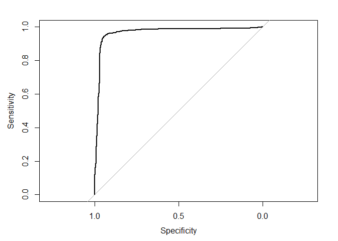<!-- -->

``` r
auc(curva_roc)
```

    ## Area under the curve: 0.9645

Area under the curve: 0.9229,

Calcularemos el modelo knn mas adelante…

\#\#arboles de decision

Como opción principal, realizaremos un modelo con todas las actividades
incluidas (Run, Walk, Hike,Ride y EbikeRide),luego de esto, nos daremos
cuenta si el modelo resulta representativo (alto porcentaje) para
posteriormente realizar el modelo predictivo.

``` r
a_pie_bici <- select(endurance_pre,"type","calories","distance" , "elev_low", "elev_high", "max_speed", "moving_time", "average_speed","total_elevation_gain" )
a_pie_bici <- filter(a_pie_bici, type %in% c("Run", "Walk", "Hike","Ride", "EBikeRide"))
```

Para realizar un modelo multi\_roc pararemos todas las actividades a un
número para poder realizar el estudio. Ride–&gt; 1 Run –&gt; 2 Walk
–&gt; 3 Hike –&gt; 4 EbikeRide –&gt; 5

``` r
a_pie_bici$type <- as.character(a_pie_bici$type)
a_pie_bici$type[a_pie_bici$type == "Ride"] <- "1"
a_pie_bici$type[a_pie_bici$type == "Run"] <- "2"
a_pie_bici$type[a_pie_bici$type == "Walk"] <- "3"
a_pie_bici$type[a_pie_bici$type == "Hike"] <- "4"
a_pie_bici$type[a_pie_bici$type == "EBikeRide"] <- "5"
```

modelo predcitivo pero con todas las variables en estudio.

``` r
a_pie_bici$type <- as.factor(a_pie_bici$type)
```

Seperamos data en train y test…

``` r
data_split_a_pie_bici <- initial_split(a_pie_bici, prop = 3/4)

# Create data frames for the two sets:
train_data_a_pie_bici <- training(data_split_a_pie_bici)
test_data_a_pie_bici  <- testing(data_split_a_pie_bici)

nrow(test_data_a_pie_bici)
```

    ## [1] 35024

``` r
#train_data %>% nrow()
```

receta tipo type\_pie\_bici

``` r
#train_data_a_pie <- train_data_a_pie %>% select(- c(is_Run))
#test_data_a_pie <- train_data_a_pie %>% select(- c(is_Run))
receta_type_pie_bici <- 
  recipe(type ~ ., data = train_data_a_pie_bici) 

receta_type_pie_bici
```

    ## Data Recipe
    ## 
    ## Inputs:
    ## 
    ##       role #variables
    ##    outcome          1
    ##  predictor          8

``` r
train_data_a_pie_bici$type <- as.factor(train_data_a_pie_bici$type)

test_data_a_pie_bici$type <- as.factor(test_data_a_pie_bici$type)
```

``` r
modelo <-
  decision_tree(tree_depth = 5, min_n = 10) %>% 
  set_engine("rpart") %>% 
  set_mode("classification")

modelo
```

    ## Decision Tree Model Specification (classification)
    ## 
    ## Main Arguments:
    ##   tree_depth = 5
    ##   min_n = 10
    ## 
    ## Computational engine: rpart

Ahora hacemos el fit del modelo, calculamos sus predicciones y
calculamos el valor de AUC

``` r
fitea_pie_bici <- function(mod){
  
  modelo_fit_is_pie_bici <- 
  workflow() %>% 
  add_model(modelo) %>% 
  add_recipe(receta_type_pie_bici) %>% 
  fit(data = train_data_a_pie_bici)

model_pred_is_pie_bici <- 
  predict(modelo_fit_is_pie_bici, test_data_a_pie_bici, type = "class") %>% 
  bind_cols(test_data_a_pie_bici) 

return (multiclass.roc(model_pred_is_pie_bici$type %>% as.integer(), model_pred_is_pie_bici$.pred_class %>% as.integer()))
}

fitea_pie_bici(modelo)
```

    ## Setting direction: controls < cases
    ## Setting direction: controls < cases
    ## Setting direction: controls < cases
    ## Setting direction: controls < cases
    ## Setting direction: controls < cases
    ## Setting direction: controls < cases

    ## Setting direction: controls > cases

    ## Setting direction: controls < cases

    ## Setting direction: controls > cases
    ## Setting direction: controls > cases

    ## 
    ## Call:
    ## multiclass.roc.default(response = model_pred_is_pie_bici$type %>%     as.integer(), predictor = model_pred_is_pie_bici$.pred_class %>%     as.integer())
    ## 
    ## Data: model_pred_is_pie_bici$.pred_class %>% as.integer() with 5 levels of model_pred_is_pie_bici$type %>% as.integer(): 1, 2, 3, 4, 5.
    ## Multi-class area under the curve: 0.741

Se ve un mejoramiento en el valor estimado de 0.74, esto quire decir que
el modelo si es representativo estadisticamente.

Ahora veremos la magia de tidymodels, haremos una comparación con otros
modelos, como el modelo de regresión logística, naive bayes o Knn. Para
esto, lo único que debemos cambiar es el modelo, ya que la receta es la
misma, y el flujo de validación también es el mismo. Por lo tanto,
podemos utilizar la función que creamos más arriba para evaluar los
diferentes modelos y compararlos. \#roc\_auc(truth = type,
.pred\_EBikeRide, .pred\_Hike, .pred\_Ride, .pred\_Run, .pred\_Walk))

\#\#MODELO LOGISTICO PARA TODOAS LAS ACTIVIDADES EN ESTUDIO.

``` r
modelo_rl <- 
  logistic_reg() %>% 
  set_engine("glm")

fitea_pie_bici(modelo_rl)
```

    ## Setting direction: controls < cases
    ## Setting direction: controls < cases
    ## Setting direction: controls < cases
    ## Setting direction: controls < cases
    ## Setting direction: controls < cases
    ## Setting direction: controls < cases

    ## Setting direction: controls > cases

    ## Setting direction: controls < cases

    ## Setting direction: controls > cases
    ## Setting direction: controls > cases

    ## 
    ## Call:
    ## multiclass.roc.default(response = model_pred_is_pie_bici$type %>%     as.integer(), predictor = model_pred_is_pie_bici$.pred_class %>%     as.integer())
    ## 
    ## Data: model_pred_is_pie_bici$.pred_class %>% as.integer() with 5 levels of model_pred_is_pie_bici$type %>% as.integer(): 1, 2, 3, 4, 5.
    ## Multi-class area under the curve: 0.741

\#\#MODELO NAIVE BAYES PARA TODOAS LAS ACTIVIDADES EN ESTUDIO.

``` r
modelo_nb <-
  naive_Bayes(smoothness = .8) %>%
  set_engine("naivebayes")

fitea_pie_bici(modelo_nb)
```

    ## Setting direction: controls < cases
    ## Setting direction: controls < cases
    ## Setting direction: controls < cases
    ## Setting direction: controls < cases
    ## Setting direction: controls < cases
    ## Setting direction: controls < cases

    ## Setting direction: controls > cases

    ## Setting direction: controls < cases

    ## Setting direction: controls > cases
    ## Setting direction: controls > cases

    ## 
    ## Call:
    ## multiclass.roc.default(response = model_pred_is_pie_bici$type %>%     as.integer(), predictor = model_pred_is_pie_bici$.pred_class %>%     as.integer())
    ## 
    ## Data: model_pred_is_pie_bici$.pred_class %>% as.integer() with 5 levels of model_pred_is_pie_bici$type %>% as.integer(): 1, 2, 3, 4, 5.
    ## Multi-class area under the curve: 0.741

\#\#MODELO KNN PARA TODOAS LAS ACTIVIDADES EN ESTUDIO.

``` r
modelo_knn <-
  nearest_neighbor(neighbors = 5) %>% 
  set_engine("kknn") %>% 
  set_mode("classification")

fitea_pie_bici(modelo_knn)
```

    ## Setting direction: controls < cases
    ## Setting direction: controls < cases
    ## Setting direction: controls < cases
    ## Setting direction: controls < cases
    ## Setting direction: controls < cases
    ## Setting direction: controls < cases

    ## Setting direction: controls > cases

    ## Setting direction: controls < cases

    ## Setting direction: controls > cases
    ## Setting direction: controls > cases

    ## 
    ## Call:
    ## multiclass.roc.default(response = model_pred_is_pie_bici$type %>%     as.integer(), predictor = model_pred_is_pie_bici$.pred_class %>%     as.integer())
    ## 
    ## Data: model_pred_is_pie_bici$.pred_class %>% as.integer() with 5 levels of model_pred_is_pie_bici$type %>% as.integer(): 1, 2, 3, 4, 5.
    ## Multi-class area under the curve: 0.741

Ya que todos los modelos no arrojan el mismo resultado, calcularemos la
curva roc en modelo\_pred\_is\_pie\_bici, probando cada uno de los
modelos visto anteriormente (Logistico, naive bayes y Knn).

``` r
modelo_fit_is_pie_bici <- 
  workflow() %>% 
  add_model(modelo_knn) %>% 
  add_recipe(receta_type_pie_bici) %>% 
  fit(data = train_data_a_pie_bici)

model_pred_is_pie_bici <- 
  predict(modelo_fit_is_pie_bici, test_data_a_pie_bici, type = "class") %>% 
  bind_cols(test_data_a_pie_bici) 
```

``` r
curva_roc1 <- multiclass.roc(model_pred_is_pie_bici$type %>% as.integer(), model_pred_is_pie_bici$.pred_class %>% as.integer())
```

    ## Setting direction: controls < cases
    ## Setting direction: controls < cases
    ## Setting direction: controls < cases
    ## Setting direction: controls < cases
    ## Setting direction: controls < cases
    ## Setting direction: controls < cases

    ## Setting direction: controls > cases

    ## Setting direction: controls < cases

    ## Setting direction: controls > cases
    ## Setting direction: controls > cases

``` r
auc(curva_roc1)
```

    ## Multi-class area under the curve: 0.8087

``` r
modelo_fit_is_pie_bici <- 
  workflow() %>% 
  add_model(modelo_rl) %>% 
  add_recipe(receta_type_pie_bici) %>% 
  fit(data = train_data_a_pie_bici)
```

    ## Warning: glm.fit: fitted probabilities numerically 0 or 1 occurred

``` r
model_pred_is_pie_bici <- 
  predict(modelo_fit_is_pie_bici, test_data_a_pie_bici, type = "class") %>% 
  bind_cols(test_data_a_pie_bici) 
```

``` r
curva_roc1 <- multiclass.roc(model_pred_is_pie_bici$type %>% as.integer(), model_pred_is_pie_bici$.pred_class %>% as.integer())
```

    ## Setting direction: controls < cases
    ## Setting direction: controls < cases
    ## Setting direction: controls < cases
    ## Setting direction: controls < cases
    ## Setting direction: controls < cases
    ## Setting direction: controls < cases

    ## Setting direction: controls > cases

    ## Setting direction: controls < cases

    ## Setting direction: controls > cases
    ## Setting direction: controls > cases

``` r
#plot(curva_roc1) 
auc(curva_roc1)
```

    ## Multi-class area under the curve: 0.7416

``` r
modelo_fit_is_pie_bici <- 
  workflow() %>% 
  add_model(modelo_nb) %>% 
  add_recipe(receta_type_pie_bici) %>% 
  fit(data = train_data_a_pie_bici)

model_pred_is_pie_bici <- 
  predict(modelo_fit_is_pie_bici, test_data_a_pie_bici, type = "class") %>% 
  bind_cols(test_data_a_pie_bici) 
```

``` r
curva_roc1 <- multiclass.roc(model_pred_is_pie_bici$type %>% as.integer(), model_pred_is_pie_bici$.pred_class %>% as.integer())
```

    ## Setting direction: controls < cases
    ## Setting direction: controls < cases
    ## Setting direction: controls < cases
    ## Setting direction: controls < cases
    ## Setting direction: controls < cases
    ## Setting direction: controls < cases

    ## Setting direction: controls > cases

    ## Setting direction: controls < cases

    ## Setting direction: controls > cases
    ## Setting direction: controls > cases

``` r
#plot(curva_roc1) 
auc(curva_roc1)
```

    ## Multi-class area under the curve: 0.8384

Nos quedaremos con el Modelo Naive bayes, ya que es el modelo más
representativo de todos, presento un área bajo la curva mayor al resto
de los modelos, específicamente de 83.84%

\#\#Matriz de confusión Ahora podemos ver los datos que fueron
etiquetados correctamente y aquellos que fueron clasificados de manera
errónea.

``` r
model_pred_is_pie_bici %>% conf_mat(type, .pred_class) %>% autoplot(type = "heatmap")
```

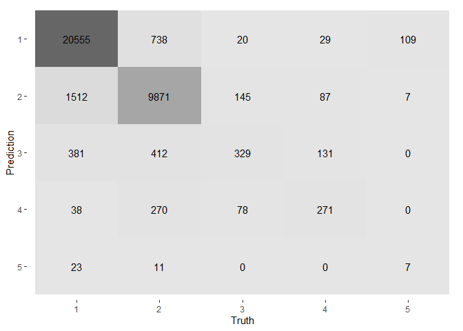<!-- -->

``` r
confusionMatrix(model_pred_is_pie_bici$type, model_pred_is_pie_bici$.pred_class)
```

    ## Confusion Matrix and Statistics
    ## 
    ##           Reference
    ## Prediction     1     2     3     4     5
    ##          1 20555  1512   381    38    23
    ##          2   738  9871   412   270    11
    ##          3    20   145   329    78     0
    ##          4    29    87   131   271     0
    ##          5   109     7     0     0     7
    ## 
    ## Overall Statistics
    ##                                           
    ##                Accuracy : 0.886           
    ##                  95% CI : (0.8827, 0.8894)
    ##     No Information Rate : 0.6125          
    ##     P-Value [Acc > NIR] : < 2.2e-16       
    ##                                           
    ##                   Kappa : 0.7714          
    ##                                           
    ##  Mcnemar's Test P-Value : NA              
    ## 
    ## Statistics by Class:
    ## 
    ##                      Class: 1 Class: 2 Class: 3 Class: 4  Class: 5
    ## Sensitivity            0.9582   0.8493 0.262570 0.412481 0.1707317
    ## Specificity            0.8560   0.9389 0.992804 0.992813 0.9966841
    ## Pos Pred Value         0.9132   0.8734 0.575175 0.523166 0.0569106
    ## Neg Pred Value         0.9284   0.9262 0.973180 0.988814 0.9990258
    ## Prevalence             0.6125   0.3318 0.035775 0.018759 0.0011706
    ## Detection Rate         0.5869   0.2818 0.009394 0.007738 0.0001999
    ## Detection Prevalence   0.6427   0.3227 0.016332 0.014790 0.0035119
    ## Balanced Accuracy      0.9071   0.8941 0.627687 0.702647 0.5837079

Ride–&gt; 1 Run –&gt; 2 Walk –&gt; 3 Hike –&gt; 4 EbikeRide –&gt; 5

Por ejemplo, Segun este modelo 20555 casos de las actividad Ride fueron
bien clasificados, 9871 casos en Run fueron bien clasificados. Por otro
lado, 738 casos de la actividad Ride fueron clasificados como Run.

Es decir un total de 31033 datos fueron bien clasificados y 3991 datos
fueron mal clasificados.
